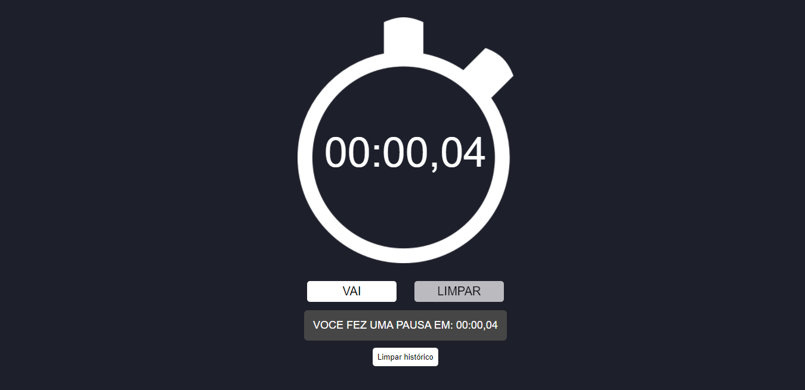

<h1 align="center">Aplicação Web - Cronômetro</h1>



## Descrição
- Projeto de estudo em VueJS.
Cronômetro com opção de pausa, armazena histórico de pausas com o tempo registrado tendo opções de limpar histórico, zerar timer ou retomar o tempo de onde parou.

## Status

⚡✅  Finalizado - Concluído  ✅⚡


## Project setup
```
npm install
```

### Compiles and hot-reloads for development
```
npm run serve
```

### Compiles and minifies for production
```
npm run build
```

### Lints and fixes files
```
npm run lint
```

### Customize configuration
See [Configuration Reference](https://cli.vuejs.org/config/).
